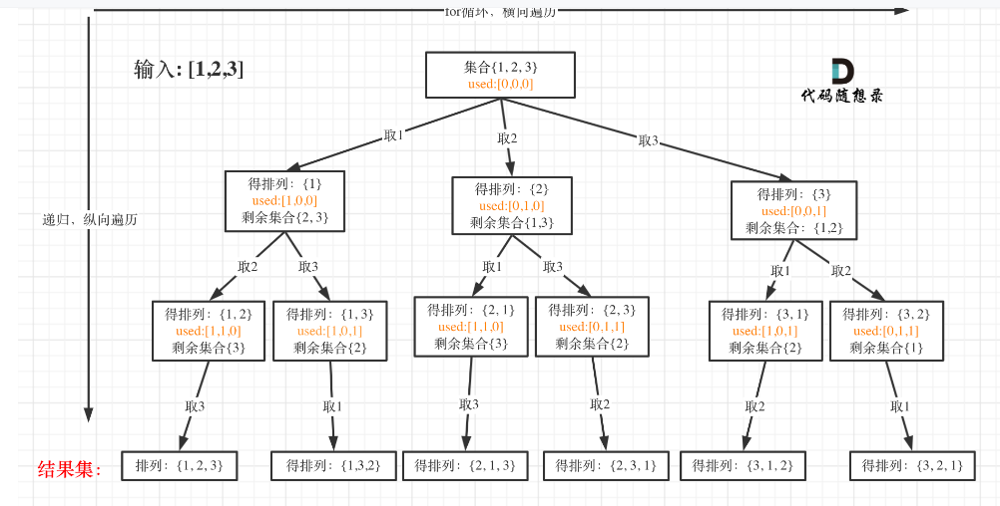
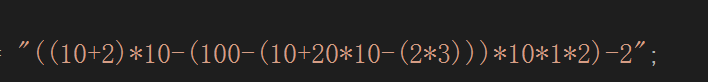
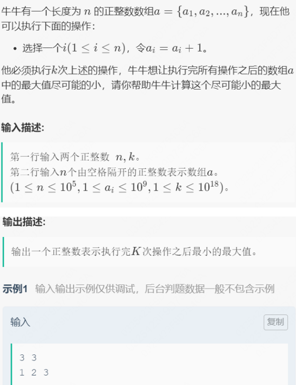

# 一、LRU

## 算法思想

> 实现方法主要是通过一个链表（list）和map进行实现  

**定义一个Node类型 存储key值和对应的value值  而在unordered_map中则存储key值和对应的value值**

定义一个Node类型<K,Y>存储数据，再重命名一个指向list<Node>类型的迭代器iter

typedef typename std::list<Node>::iterator iter;作为哈希表的value值 同时cap_作为LRUcache中可存储的最大数据量 超过这个值就删除久未使用的数据

get方法：传入K值，如果存在返回-1，未找到；若存在的话就返回他的VALUE值，并且用it指向这个数据，用list中的splice函数将其放在list开头。


set方法： 传入key和value值 ，  如果key存在，设置其value并且将其放到list的头部    否则：
如果list.size（）已满   ，删除ump和list中最后一个位置的数据，再在list头部插入数据，同时ump中插入key让ump的value值为list.begin（）

```C++
#include<iostream>
#include<vector>
#include<list>
#include<string>
#include<unordered_map>
#include<algorithm>
using namespace std;
//LRU缓存   久未使用的数据放在最后
template<class KTYPE,class VALUE>
class LRUCache
{
private:
	typedef typename std::pair<KTYPE,VALUE> Node;
	typedef typename std::list<Node>::iterator iter;
private:
	int cap_;//指定可以存的KEY的容量
	list<Node>mylist;//key 和  value
	unordered_map<KTYPE,iter>ump;//key值对应保存的是key在list中所在的位置
public:
	LRUCache(int cap):cap_(cap){}
	VALUE Get(KTYPE key)
	{
		if(ump.count(key) <= 0)
		{
			return -1;
		}
		else
		{
			iter it = ump[key];
			VALUE value = it->second;
		}
		mylist.splice(mylist.begin(),mylist,it);//将it位置元素放到开头位置
		return value;
	}
	void Set(KTYPE key,VALUE value)
	{
		if(ump.count(key) > 0)//若已存在，对其进行设置调整
		{
			iter it = ump[key];
			it->second = value;
			mylist.splice(mylist.begin(),mylist,it);
		}
		else if(ump.count(key) == 0)
		{
			if(mylist.size() == cap_)//list已满
			{
				ump.erase(mylist.back().first);
				mylist.pop_back();
			}
			mylist.push_front(make_pair(key,value));
			ump[key] = mylist.begin();
		}
	}
	void show()
	{
		for(auto it = mylist.begin();it != mylist.end();++it)
		{
			cout<<it->first<<":"<<it->second<<endl;
		}
	}
};
int main()
{
	LRUCache<string,int>lru(5);
	lru.Set("aaa",1);
	lru.Set("aa",5);
	lru.Set("aaah",6);
	lru.Set("aaag",2);
	lru.show();
}
```

# 二、回溯算法

> 经典例题

## 例1：数组或者字符串中的全排列问题



```C++
class public
{
    vector<vector<int>>VEC;
    vector<int>vec;
    public:
    void dfs(vector<int> &nums,vector<bool>&used)//传入str以及一个used数组判断数据是否被使用过
    {
        if(vec.size() == nums.size())//说明已经找到一种排列方式
        {
            VEC.push_back(vec);
            return;
        }
        
       
        for(int i = 0;i < nums.size();++i)
        {
            if(used[i] == true)continue;//被使用过，看下一个数据
            used[i] = true;//将其置为已使用过
            vec.push_back(nums[i]);
            dfs(nums,used);
            vec.pop_back();//每次回溯完成后删除一个vec中存在的数据 换下一个组合
            used[i] = false;//下一趟从i+1开始而此次的used【i】就置为未使用了
            
        }
    }
    vecctor<vector<int>> pre(vector<int>&nums)
    {
        vec.clear();
        VEC.clear();
        vector<bool>used(nums.size(),false);//设置一个初始化大小为nums.size()且全为false的数组
        dfs(nums，used);
        //有时候需要去重，比如55  会得到两种相同的结果 55 55
        //去重
        set<string>s<VEC.begin(),VEC.end()>;//利用set容器去重  
        VEC.assign(s.begin(),s.end());//再重新放入VEC中   去重已经完成
        return VEC;
        
    }
}
```

## 例2：岛屿数量问题

> dfs算法和bfs算法：  dfs算法是深度优先遍历，遇到中止条件时才会返回，bfs则是广度优先遍历，先把当前位置附近的访问一遍，再放大继续访问

问题描述;**给定一个矩阵 ，这个矩阵中为1的位置代表岛屿，为零的位置代表海洋，如果多个‘1’连在一起则记作一个岛屿，求指定矩阵的岛屿数量**

首先利用dfs深度优先遍历的思想解决这个岛屿问题的思想：**首先深度优先遍历，最简单的方法就是遍历数组中的每一个位置，如果是‘1‘说明是岛屿，再依次遍历该位置上下左右的值，如果为‘1’，说明是相连的，将它置为0，再遍历该点的上下左右    如果是‘0’的话说明不是岛屿就不需要往其他位置遍历了**


```c++
class Solution
{
    public:
    int solve (vector<vector<char>>&grid)
    {
        if(grid.size() == 0)return 0;
        int count = 0;
        for(int i = 0;i < grid.size();++i)
        {
            for(int j = 0;j < grid[0].size();++j)
            {
                if(grid[i][j] == '1')//说明是岛屿  检查周围位置
                {
                    count++;//岛屿数量+1
                    dfs(grid,i,j);//遍历‘1’位置的上下左右四个位置数据
                }
            }
        }
        return count;
    }
    //dfs算法遍历该点的上下左右位置
    void dfs(vector<vector<char>>&grid,int i, int j)
    {
        if(i < 0||i>=grid.size()||j<0||j>=grid[0].size())return;
        grid[i][j] = '0';//将当前位置字符置为’0‘
        dfs(grid,i-1,j);//dfs指定点的上方
        dfs(grid,i+1,j);//dfs下方
        dfs(grid,i,j-1);//dfs左方
        dfs(grid,i,j+1);//dfs右方
    }
    
};
```


# 三、接雨水的问题  （双指针的灵活应用）

> 用一个数组来表示类似容器的池子   计算该  类容器下雨时最多可以接的储水量  一个格子代表一个单位的储水量

首先应该思考每一个柱子可以存储的水量 应该由什么决定

# 双栈实现表达式



两个进入cal条件

1.遇到右括号

2.遇到+  -   符号

乘号不影响计算结果  直接 push    遇到+-号的时候 先看符号**之前**的nums数组中的数据是否可以进行计算

确保 乘法在加减法之前已经被计算完成了

定义两个数组，一个nums  一个ops（    +-*（   ）

cal方法   计算 两数相加、相减、相乘

while遍历数组   遇到 字符数字   先确保转化为十进制数   num = num*10 + 是【i】-0

else

遇到“（”直接存入ops  遇到右括号  进行cal   直到遇见 “）”停止

遇到“*”直接存入ops

遇到+-   判断nums数组是否大于等于2   是的话再判断ops.top（）是否为（，，不可以越过（进行运算      cal之后再将遇到的符号存入ops中

最后判断一次nums和ops是否为空      因为有可能最后没有符号和）来进入cal   


```class Solution {

    int cal(int k2, int k1,char o)
    {
        if(o=='+'){
            return k2+k1;
        }else if(o=='-'){
            return k2-k1;
        }else{
            return k2*k1;
        }
    }
    int solve(string s) {
        // write code here
        stack<int>nums;
        stack<char>ops;
        int i = 0;
        for(i = 0;i < s.size();)
        {
            if(s[i]>='0'&&s[i] <= '9')
            {
                int k = 0;//每次将k置为0
                while(i < s.size()&&s[i]>='0'&&s[i]<='9')
                {
                    k = k*10 + s[i] - '0';
                    i++;//i必须在此处++ "123"->123
                }
                nums.push(k);
            }
            else
            {
                if(s[i] == '(')ops.push(s[i]);
                else if(s[i] == ')')
                {
                    while(ops.top() != '(')
                    {
                        int k1 = nums.top();
                        nums.pop();
                        int k2 = nums.top();
                        nums.pop();
                        char o = ops.top();
                         ops.pop();
                        nums.push(cal(k2,k1,o));
                    }
                    ops.pop();
                }
                else if(s[i] == '*')
                {
                    ops.push(s[i]);
                    
                }
                else//+   - 
                {
                    while(nums.size()>=2)
                    {
                        if(ops.top()=='(')break;//不能越过（去运算
                         int k1 = nums.top();
                        nums.pop();
                        int k2 = nums.top();
                        nums.pop();
                        char o = ops.top();
                        ops.pop();
                        nums.push(cal(k2,k1,o));
                    }
                    ops.push(s[i]);//push之前执行
                }
                i++;
            }
            
        }
        //剩余两个值有可能是没有右括号来进入cal的
         while(!ops.empty()){
            int k1 = nums.top();
             nums.pop();
            int k2 = nums.top();
             nums.pop();
            char o = ops.top();
             ops.pop();
            nums.push(cal(k2,k1,o));
        }
        int res = nums.top();
        nums.pop();
        return res;
    }
};
```

# 两个栈实现一个队列

> 首先两个栈实现一个队列的问题，对于插入操作都是一样的直接push进来就可以完成
>
> 但是对于删除操作却有所不同，由于队列pop的时候都是从头部开始pop，而栈则是从尾部开始pop
>
> 所以可以定义两个栈，一个栈来push数据，而另一个作为辅助栈pop的时候使用
>
> 队列pop的时候，如果s2是空的情况下，直接把s1的数据全部导入到s2中，此时s2的top就是队头数据了
>
> 直接s2.pop就可以了。如果s2不为空的话就先得把s2数据pop空  再把s1中数据倒入s2中

```c++
class Cqueue
{
    public:
    stack<int>st1,st2;
    Cqueue(){
        
    }
    void appendtail(int val)
    {
        st1.push(val);
    }
    //栈和队列的区别在于  pop的时候
    int deletehead()//返回删除掉的数据
    {
        if(st1.empty()&&st2.empty())return -1;//如果两个栈都为空 没有数据了就返回-1
        if(!st1.empty()&&st2.empty())\\如果栈2空  栈1不空   把数据导入栈2
        {
            while(!st1.empty())
            {
                st2.push(st1.top());
                st1.pop();
            }
        }
        \\注意 ；  如果中途有数据插入   必须先pop完栈2的数据再对栈1中加入的数据进行处理
        \\如果两个栈都不空的情况下 和 栈1空栈2不空的情况下   都是先pop完栈2的数据
        int res = st2.top();
        st2.pop();
        return res;
    }
    
    
    
};
```

# 包含min函数的栈

> 思想很简单就是  要求o（1）复杂度  就是在min函数中能够直接返回栈中最小的数据
>
> 我们可以定义两个栈就能很好地完成要求了   一个正常处理栈数据地栈 和一个存储当前栈中最小数据地minst
>
> ```c++
> calss minstack
> {
>     public:
>     stack<int>st,minst;
>     minstack(){}
>     void push(int x)
>     {
>         st.push(x);
>         \\minst为空的情况和minst栈顶数据大于x的话进行push，使得minst栈顶始终为栈中最小的数据
>         if(minst.empty()||minst.top()>=x)//注意有多个一样的最小数据都得push进来
>         {
>             minst.push(x);
>         }
>     }
>     void pop()
>     {
>         if(minst.top() == st.top())//如果删除的恰好是最小的元素 则minst中的栈顶元素也要删除
>         {
>             minst.pop();
>         }
>         否则 只用pop   st中的数据
>         st.pop();
>        
>     }
>     int top()
>     {
>         return st.top();
>     }
>     int min()
>     {
>         return minst.top();
>     }
>     
> };
> ```
>
> 

# 最小的最大值



> **执行k次a[i] + 1  使得数组中最大值尽可能的小**

首先，要使得这个数组中最终的结果最小，那么我们就得找处原数组中的最大值，将数组中的每个元素

依次加到这个最大值，每加一次 消耗一次k操作，如果加完了，k还是大于0的  那么就将新数组依次加1

直到k消耗完（注意：此处k的值在10的19次方  int类型是无法达到那么大  得用long整形）

```c++
#include<iostream>
#include<vector>
using namespace std;
int main()
{
    long n,k;
    cin>>n,k;
    vector<long>vec;
    for(long i = 0;i < n;++i)
    {
        long a;
        cin>>a;
        vec.push_back(a);
    }
    if(vec.empty())
    {
        cout<<0<<endl;
        return 0;
    }
    long Max = vec[0];
    for(auto& val :vec)
    {
        Max = max(Max,val); 
    }
    for(long i = 0;i < vec.size();++i)
    {
        k-= Max - vec[i];
        vec[i] = Max;
        if(k <= 0)//k等于0  或者 k小于0说明k用完了，减到小于0不影响最小的最大值
        {
            break;
        }
        //while(vec[i] < Max)
        //{
            //vec[i]++;
           // k--;
        //}
    }
    //出了for循环  如果k还是大于0   说明k没用完 依次给数组中的元素执行++
    if(k > 0)
    {
        //如果k很大的话  需要遍历很多次数组 现在的数组是全为max的一个数组
        Max = Max + (k/vec.size());//max加上  
        if(k%vec.size() != 0)//如果还有余数  说明还有多余的k次操作没有使用，此时的max就得++
        {					 //最后的余数肯定只够一轮操作  最多使得max+1；
            Max++;
        }
        //比如k为 17  size为8   则需要再遍历三轮 前两轮全部遍历完  余数1需要再再给数组++；最终max++
        cout<<Max<<endl;
        return 0;
            
    }
}
```

# 复杂链表的复制

根据一个已有的复杂链表复制出来一个完全相同的链表

这个链表必须是完全重新复制出来的一份，而不是还是只想原来的结点

所以复制出来的新链表必须是new出来的，但由于这个复杂链表中是有random指针的，无法让他确定新链表的random指针指向哪里，所以最好的办法就是依次复制新链表节点，并让他跟在原链表结点后边  类似

**1 -> 2 -> 3       1->1->2->2->3->3**确定完random指针之后再将这个链表拆分

```c++
class Solution {
public:
    Node* copyRandomList(Node* head) {
        //复制链表  形成拼接链表
        Node*cur = head;
        while(cur != nullptr)
        {
            Node* node = new Node(cur->val);
            node->next = cur->next;//必须先把复制出来的结点和cur-》next连接起来否则断开后机找不到原链表的第二个结点位置了
            // 1  2  ====   1  1  2
            cur->next = node;
            
            cur = cur->next->next;
        }
        cur = head;
        //确定random指针
        while(cur != nullptr)
        {
            if(cur->random != nullptr)//等于nullptr不用管
            {
                cur->next->random = cur->random->next;
            }
            cur = cur->next->next;
        }
        //拆分链表
        Node* copyhead = head->next;//记录拷贝链表的首位置方便返回
        Node* copynode = head->next;
        cur = head;
        while(cur != nullptr)
        {
            //先拆分出原链表   拼接链表是由next指针连接起来的  改变next指针即可
            cur->next = cur->next->next;
            cur = cur->next;//到达原链表的下一个结点
            if(copynode != nullptr)//因为复制链表的最后一个结点的next指向的是空 不需要再去让他走到nullptr，所以最后一步的时候  只需要让原链表的next指针断开去指向空就可以了
            {
                copynode ->next = copynode->next->next;
                copynode = copynode->next//移动下个位置继续断开next指针指向
            }
        }
        return copyhead;
    }
};
```

# 字符串替换（不需要额外申请空间）

> 替换字符串中的空格  其实很简单，只要再new出来一个newstr来存储没有空格的字符串就好了
>
> 但是在面试的过程中的话  面试官想得到的结果i肯定不是这样，而是一种不需要申请额外空间的方法
>
> 所以我们首先将这个字符串中的空格计算出来有多少个，再对字符串进行扩容，扩至刚好能放下我们需要的字符串为止
>
> ```c++
> class Solutions
> {
>     string replaceSpace(string s)
>     {
>         int count = 0;
>         int oldsize() = s.size();
>         for(auto&x;s)
>         {
>             if(x = ' ')count++;
>         }
>         //扩容
>         s.resize(s.size()+2*count);
>         int newsize = s.size();
>         for(int i = oldsize,j = newsize;i >=0;i--,j--)
>         {
>             if(s[i] != ' ')s[j] = s[i];
>             else
>             {
>                 s[j] = '0';
>                 s[j-1] = '2';
>                 s[j-2] = '%';
>                 j-=2;//j在此处多用了两个位置所以得-2，原来j在此处只有一个位置
>             }
>         }
>         return s;
>     }
> };
> ```
>
> # 字符串左旋转
>
> > 此题和上边提醒也有异曲同工之妙，我们需要提升这道题的质量，也在不审定额外空间的前提下把这道题目完成
> >
> > 看示例: 
> >
> > 通过这个例子我们可以看出 题目是要求把k=2处开始到结束的位置去放到字符串的首位置上
> >
> > 我们又恰好直到string类有个reverse函数，那么我们可以试想能否把下标为2处的字符放到最末尾再进行reverse呢？当然是可以的， 所以此处用到了局部反转+整体反转的方法
> >
> > 先把0daok-1处的字符串反转，在把k到末尾的字符串反转，最后再整体反转即可得到最后的结果
> >
> > ```
> > 输入: s = "abcdefg", k = 2
> > 输出: "cdefgab"
> > ```

```c++
class Solution {
public:
    string reverseLeftWords(string s, int n) {
        if(n == 0)return s;
         //先局部反转 ，在整体反转，不需要申请额外空间
         reverse(s.begin(),s.begin()+n);//反转的第二个参数  是从开头开始到第二个参数的前一个位置
         reverse(s.begin()+n,s.end());
         reverse(s.begin(),s.end());
         return s;
        

    }
};
```

# 二分法查找排序数组中target出现的次数；

left  < right  时；left == right时就可以退出   left<= right时   必须right小于left才能退出，所以right得等于mid-1


eg：7  8

第一次：left = 7  left=right=mid+1了 不退出  下一次进来的时候right = mid-1才达成退出条件

```c++
class solution
{
    public:
    int srarchTarget(vector<int>nums,int target)
    {
        int left = 0,right = nums.size()-1;
        while(left < right)//left小于right  right = mid;left<=right  right = mid-1;
        {
            int mid = (left+right)/2;
            //如果要查找的target小与中间位置的数据   那么说明target在mid左边  把right置为mid
            //如果查找的target比中间位置的元素大 说明target在右边  把left置为mid
            if(nums[mid] >= target)right = mid;//nums[mid]大于目标值后right变为mid
            else (nums[mid] < target)left = mid+1;//只有nums【mid】比目标值小的情况下left才动  缩小范围
        }
        int count = 0;
        while(nums[left]<nums.size()&&nums[left++]==target)
        {
            count++;
        }
        return count;
    }
};
```

