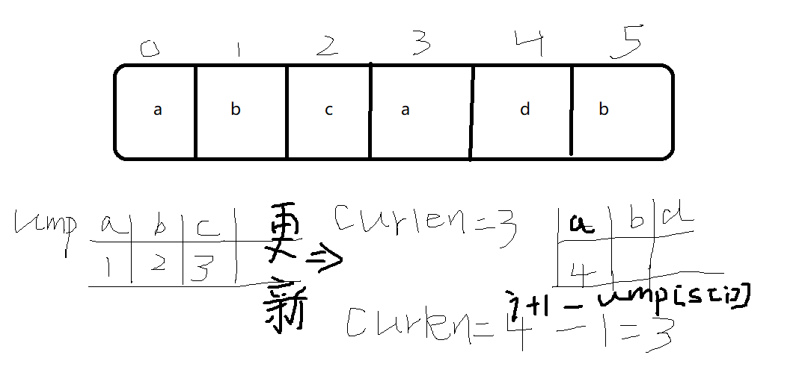

# 重复子字符串问题

给定一个非空字符串，判断它是否可以由它的一个子串重复多次构成


**kmp算法**

字符串的前缀就是不包含最后一个字符而**包含第一个字符**的所有子串；后缀就是不包含第一个字符而**包含最后一个字符**的所有子串

最长相等前后缀：字符串中前缀子串和后缀子串相同的最长**长度**

原生最长**相等**前后缀||原生最长**相等**前后缀统一减1||原生最长**相等**前后缀统一右移一位  就是next数组

例：a  a  b  a  a  f

​       0  1  0  1  2  0    **-1  0  -1  0  1  -1**

​     

```c++
class Solution
{
    public:
    bool ismadeByson(string &s)
    {
        int n = s.size();
        //至少由两个子串构成  遍历前半部分  i 是长度
        for(int i = 1;i*2 <= n;++i)
        {
            if(n%i==0)//必要条件  能够整除才能说明是由这个子串构成
            {
                bool flag = true;
                for(int j = i;j < n;++j)
                {
                    if(s[j] != s[j-i])
                    {
                        flag = false;
                        break;
                    }
                }
                if(flag == true)return true;
            }
            
        }
        return false;
    }
};
```

# 无重复子字符串的最大长度

```c++
class solution
{
    public:
    int longestlength(string s)
    {
        //在ump中将字符作为key，此次出现key时字符串的长度作为value
        //遍历时将未出现过的字符的value值存为index+1；出现过的也是index+1；但是需要更新curlen
        //新的curlen就等于 当前长度（index+1） 减去  上一次出现这个重复字符串时候的长度
        int curlen = 0;
        int maxlen = 0;
        unordered_map<int,int>ump;
        for(int i = 0;i < s.size();++i)
        {
            if(ump[s[i]] == 0)//没出现过
            {
                ump[s[i]] == i+1;
                curlen++;
            }
            else//出现过   更新最大长度
            {
                //当前长度  -   上一次出现这个字符时的长度
                curlen = i+1 - ump[s[i]];//更新curlen   此时的ump[s[i]]存储的就是上一次s[i]出现时候的长度
                ump[s[i]] = i+1;
            }
            maxlen = max(maxlen,curlen);
        }
        return maxlen;
    }
};
```



# 重复的DNA序列

返回DNA序列字串中出现超过一次的子串   且目标子串的长度为10

```c++
class Solution {
public:
    vector<string> findRepeatedDnaSequences(string s) {
        unordered_map<string,int>ump;
        vector<string>res;
        if(s.size() < 10)return res;//长度小于10，则不存在目标子串
        //使用一个ump存储  所有可能子串以及子串出现的次数
        //最后遍历ump找到出现次数大于1的子串即可
        //为了确保目标子串的长度大于等于10，设置i <= s.size() -10
        //等于s.size()-10  的时候是最后一个可能子串
        for(int i = 0;i <= s.size()-10;++i)
        {
            string tmp = s.substr(i,10);
            ump[tmp]++;
        }
        for(auto &it :ump)
        {
            if(it.second >=2)
            {
                res.push_back(it.first);
            }
        }
        return res;
    }
};
```

