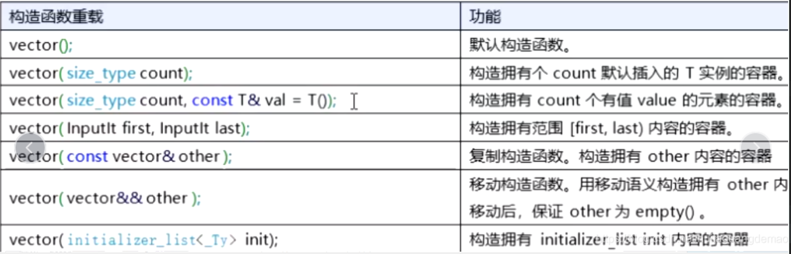

## C++学习笔记

## github操作备忘

### github文件位置   E/mystudy/github


找到具体需要添加文件的位置  ，git clone + 密匙地址



```

```

```
 ``rows = matrix.size();
    ``cols = matrix[``0``].size();
    ``vector`int``> > mem(rows, vector<``int``>(cols));
```

vector<vector<int>>  name (行,类型(num))